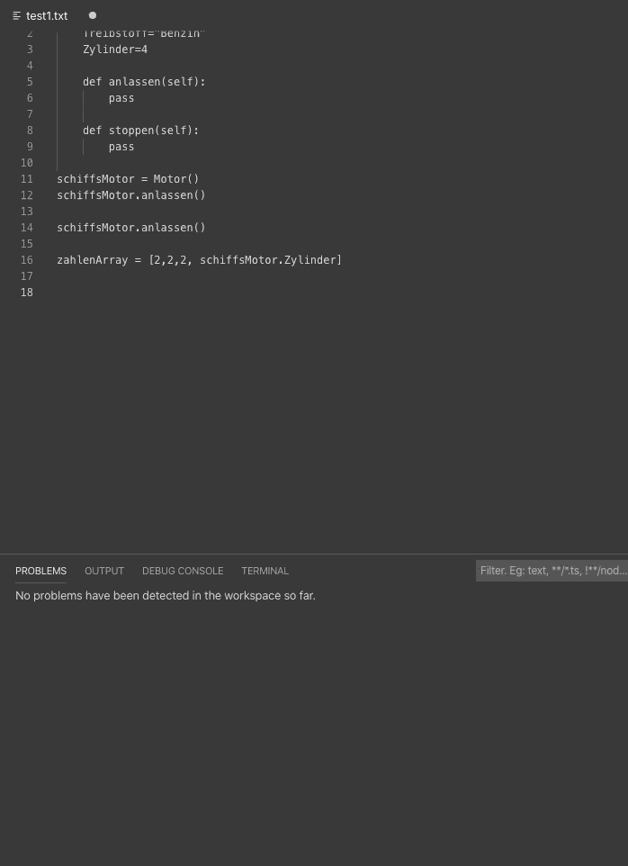

# Python-Typchecker

This was my Project for the Compilerbau Module. It contains an extension for the VSCode editor, which creates a LanguageServer as well as
an LanguageServer Client, written in Java. The goal was to track the typ of variables in a linear Python programm and warns the user, if he 
or she 

1. tries to call an objects methods that doesn't exsist (ex. typos)
2. tries to assign a variable a new value that was assinged a value of an other type before 
3. tries to instantiate a list of values with mixed types
4. tries to use a value as an Identifier
5. tries to use a variable in a statement that wasn't declared before
6. some other miscellaneous warnings 

This is of course just a small linter and it only works with an outdated version of VSCode, so I wouldn't try to get this running.
So here are three gif that show the Typechecker working:

I used antlr4 to build the parsetree in combination with a python3 grammar, which I modifed to support "MakeShiftTypes",
so I could evaluate if a buildin type like string or number was assigned to a variable. The original grammar can be found here:
https://github.com/antlr/grammars-v4/tree/master/python/python3
